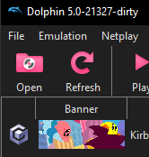
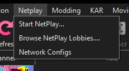

# To Reach Pop Star

Once your [KARphin instance is set up for Netplay](SetupNetplay.md), we can actually join and host games.

In KARphin's modified menu, Networking features and Netplay have been moved to their own menu item.

<h1>Docs are Missing go to the Discord for how to host and join</h1>

## Hosting

## Joining

## Searching for Lobbies