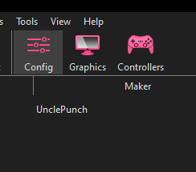

# Hello Internet, is anyone there?

## The Discord

In the event you're still having issues after trying both the written and video guide. Head to the [Netplay Discord](http://discord.gg/p3rGrcr), they can help you trouble shoot.

# Video Guide

Video guides can go out of date easilly. Especially with WIP software like this one. If the video doesn't work, we have a written guide below it.

# Written Guide

## Step 0
Make sure you got internet and a Ethernet connection. KARphin still uses Dolphin's netcode, meaning no relays. Having a consistent strong connection is importaint in a fast paced game like KAR.

## Step 1
Get a copy of KARphin, either directly downloading it from [Releases](https://github.com/SeanMott/KARphin/releases), or using [KAR Workshop](). We <b> highly</b> recommend using [KAR Workshop]() for downloading both KARphin and rest of the needed Netplay tools.

Your install will look more or less like this. This install is a fresh, no user settings or anything.

## Step 2

Run Dolphin by clicking on it.

You're gonna be asked if you wanna send Usage Data, you can click no, KARphin data won't help Dolphin Team.

With the pop up gone away with, that leaves us with the modified main menu. KARphin has a few tweaks from the standard Dolphin 5.0 one. Like moving the Netplay and Mod related menu items into their own catagories.

You can explore in your own time, but for right now press File, then "Prep Install For KAR Netplay".

The pop up might look scary, but it just warning you this instance of KARphin is going to be reset. Which is fine as it's brand new. This will pull down all the needed Gekko Codes, AR Codes, and search for your copy of KAR Hack Pack by syncing with KAR Workshop.

If you downloaded KARphin and don't have a KAR Workshop instance. KARphin will still get all the Gekko and AR Codes, but you will have to tell it where the Hack Pack is located. We will get to that later. For right now, press Yes.

<b>KARphin closing IS NORMAL</b>. All you have to do is reopen the program like before.

Congrats, your instance of KARphin is all ready to go. From here, if your Hack Pack ROM is visable. You can move onto either [Hosting/Joining a game](PlayingNetplay.md), or [Importing Your Settings From Slippie](ImportingSlippieSettings.md). If you used the old Dolphin build.

If your ROM <b>DID NOT</b> appear in the main menu after going through the Prep Netplay prompt. Stay here, we'll get you fixed up.

## Houston, My ROM is missing....

So your ROM did not appear when you Prepped your build for Netplay. Make sure KARphin is open. You are going to press the Config button.

This will bring up another window, this handles general settings native to Dolphin. But our goal is the Paths tab. Press "Paths".

We don't care about anything else except for <b>Game Folders</b>. This is a list of paths to various directories containing ROMs. In this case you are going to click "Add..."

You will be prompted to select a directory, simply navagate to the folder containing the Kirby Air Ride Hack Pack ISO and press Select Folder. After closing the Settings window, the Hack Pack ROM should be in the main menu.

From here you are all ready to get started, move to either [Hosting/Joining a game](PlayingNetplay.md), or [Importing Your Settings From Slippie](ImportingSlippieSettings.md).