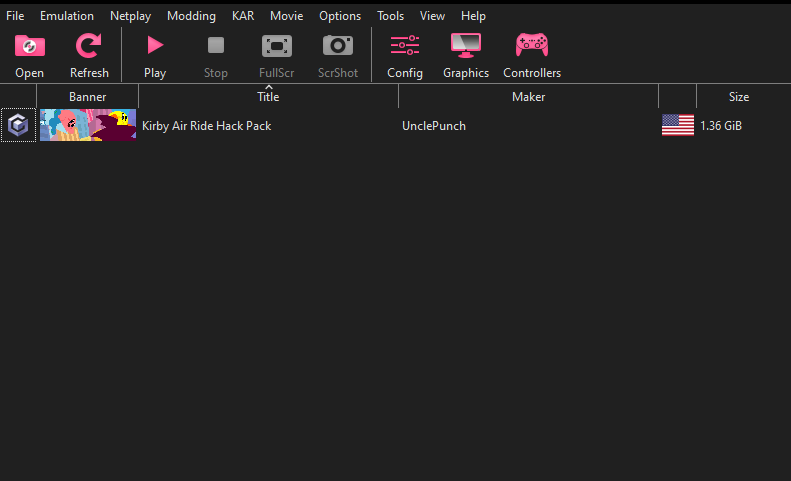
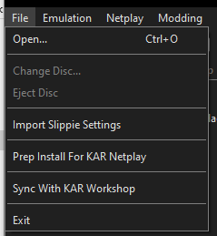

# KARphin - A ~~GameCube and Wii~~ Kirby Air Ride Emulator

[Netplay Website](https://www.kirbyairrideonline.com/) | [Netplay Discord](http://discord.gg/p3rGrcr) | [Wiki](https://kar.miraheze.org/wiki/Main_Page) | [KAR Workshop]()

KARphin is an emulator for running Kirby Air Ride Netplay on Windows,
Linux, macOS, and Android. It's licensed under the terms
of the GNU General Public License, version 2 or later (GPLv2+).

We recommend using [KAR Workshop]() for downloading both KARphin and rest of the needed Netplay tools. Otherwise directly download KARphin from [Releases](https://github.com/SeanMott/KARphin/releases).

## Why can't I just use normal Dolphin?

KARphin offers a few updates and tweaks specific to this game. We used to use a old Slippie build, but it got so out of date and the Linux build stopped working. So now we got a fancy (as of 04-19-2024) modern Dolphin build with some bells and whistles.

## BUT MY CONTROLLER SETTINGS!!!!

Don't worry, KARphin supports importing Controller keys and Profiles from Slippie/Faster Melee. After you run "Prep Install For KAR Netplay" and have your Waddle Dees in order.

Click "Import Slippie Settings" and provide the full path to the folder your Faster Melee/Slippie folder is located.

## What if I haven't played KAR ever or not since I was a kid?

Don't you worry KAR grand champ to be, we got a few tutorials and links to how the game plays and some meta videos.

- [What Are the Patches?](https://www.youtube.com/watch?v=awdgofcJlbc)

- [Machines Explained](https://www.youtube.com/watch?v=E48DGPncK8g)

- [KAR Is A Fighting Game!](https://www.youtube.com/watch?v=TDafSNoOXT4)

- [Rules For Netplay](https://www.kirbyairrideonline.com/leaderboards)

And don't forget to ask in the Discord, the best way to learn is play with others. So see ya in the City, champ in the making!

## But I don't know to set this up.

Always check the [Discord](http://discord.gg/p3rGrcr) for the most up to date instructions and any addendum that haven't been added here. But it only requires two button presses and you'll be tearing it up in The City in no time. For the sake of README simplicity we have moved it to it's own [page here](READMES_ASSETS/Netplay/SetupNetplay.md).

## Video Backends

- Vulkan (runs on Mac)
- Direct 3D (D3D) and DirectX 12 (D312) only available on Windows.
- Software Rendering (Intended for Developer/Debug only)

## Audio Backends

- HLE (High Level Emulation) is faster but less accurate
- LLE (Low Level Emulation) is slower but close to perfect. Note that LLE has two submodes (Interpreter and Recompiler).

## System Requirements

### Desktop

* OS
    * Windows (10 or higher).
    * Linux.
    * macOS (10.15 Catalina or higher).
    * Unix-like systems other than Linux are not officially supported but might work.
* Processor
    * A CPU with SSE2 support.
    * A modern CPU (3 GHz and Dual Core, not older than 2008) is highly recommended.
* Graphics
    * A reasonably modern graphics card (Direct3D 11.1 / OpenGL 3.3).
    * A graphics card that supports Direct3D 11.1 / OpenGL 4.4 is recommended.

### Android

* OS
    * Android (5.0 Lollipop or higher).
* Processor
    * A processor with support for 64-bit applications (either ARMv8 or x86-64).
* Graphics
    * A graphics processor that supports OpenGL ES 3.0 or higher. Performance varies heavily with [driver quality](https://dolphin-emu.org/blog/2013/09/26/dolphin-emulator-and-opengl-drivers-hall-fameshame/).
    * A graphics processor that supports standard desktop OpenGL features is recommended for best performance.

### Web
 * Not happening, Web GL is too slow, maybe when [Web GPU](https://www.khronos.org/assets/uploads/developers/presentations/WebGL__WebGPU_Updates_2024-03.pdf) (yes, it's a real spec) is fully implemented.

### Switch
* Not ready yet, but if you're apt about it, remember the Switch is a chained down Android device.

 
<b>KARphin can only be installed on devices that satisfy the above requirements. Attempting to install on an unsupported device will fail and display an error message.</b>

## Why are there so many Branches on Git?

- Master || The bleeding edge of all our features and tweaks, the one all other branches get merged into once their purpose is finished.

- Release-xxxxx || The specific release for each of the versions ie 1.0.0, 2.543.2, 5.0, ect

- Jas Toys || A special branch for Jas's side experiments and things that might get put into the final Release or never see the light of day

- Bare Metal || A branch with the special Netplay code replacemnt stripped out and regular Dolphin with very few *aesthetic* and KAR tweaks.

## What if I wanted to compile it myself?

Well buddy, you and I got something in common. That's why the build instructions were moved to a dedicated folder, split out into their own file for ease of reading. Most of them are straight forward and what we use ourself. If you have a fix/improvement, we welcome issues and pull requests. If you make something neat, Jas likes cool software toys. He can be found through the KAR discord.

- [Windows Build](READMES_ASSETS\Building\Building_Windows.md)
- [Mac Build](READMES_ASSETS\Building\Building_Mac.md)
- [Linux Build](READMES_ASSETS\Building\Building_Linux.md)
- [Android Build](READMES_ASSETS\Building\Building_Android.md)
- [Switch Build](READMES_ASSETS\Building\Building_Switch.md)

## Who are the lovly people who put this thing togeather?

* That would be me, your dashing Slavic README writer and main programmer, Jas. I handle the guts of the software and making all the tweaks and started the project on a whim.

* Jinxy, as a second pair of eyes for hunting down some of the quriks with Dolphin's code. And gave another opion on how I went about tackling the project in some of the features or sub systems of Dolphin. KARphin's Prep Netplay button wouldn't be as clean and easy without them.

* Hey Now, my willing test subject and feedback-er person during my rabbles at every hour of the night as I spammed his DMs with KARphin stuff.

* Kinix, our resident admin of the [KAR Discord](http://discord.gg/p3rGrcr) and adament supporter of this insane idea. I still owe ya a beer buddy.